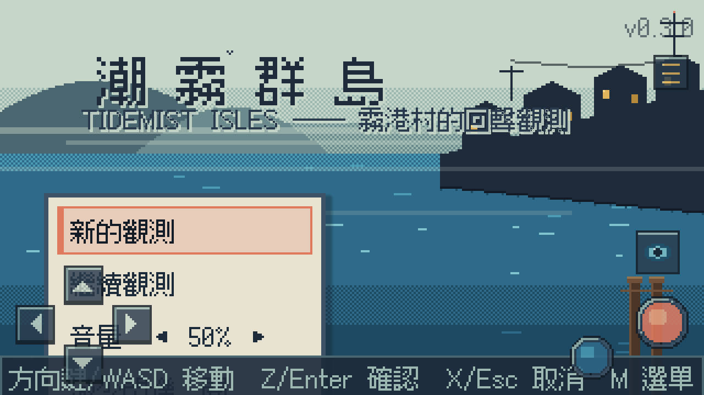
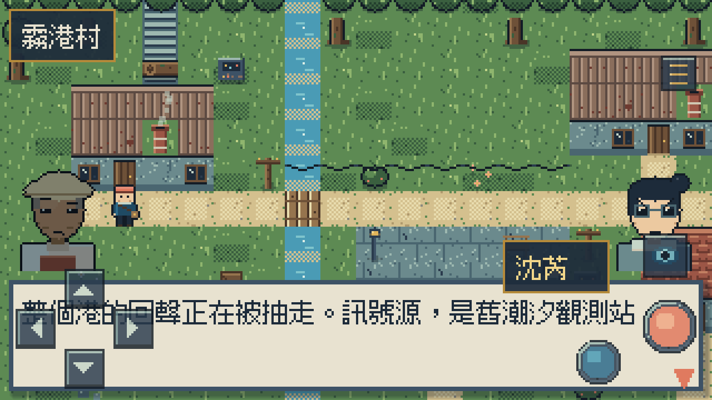
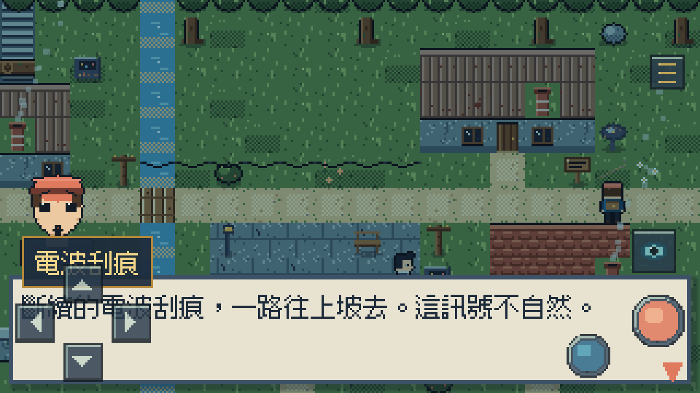
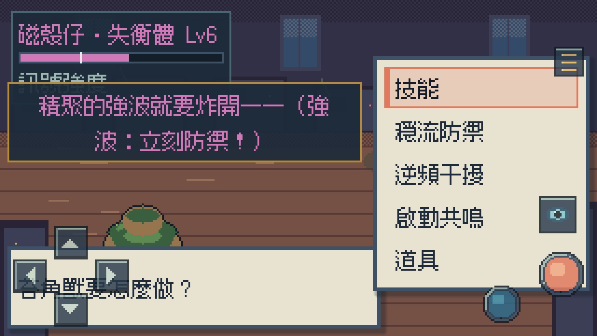
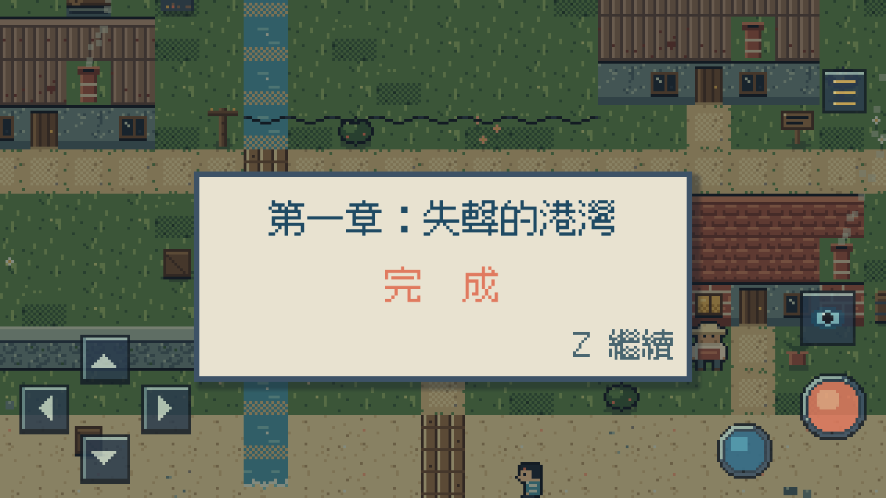

# 潮霧群島 Tidemist Isles — 第一章：失聲的港灣

原創 2D 像素 RPG 的 **3–5 分鐘完整關卡 DEMO**。
霧港村的浮標還在浪裡搖，鐘聲卻消失了。你是新上任的**回聲觀測員**：
用回聲觀測判讀線索、穿過潮霧古道、在廢棄潮汐觀測站面對被三十年殘留訊號
纏住的**磁殼仔**——不是打倒牠，而是在正確的時機**建立共鳴**，把耳朵還給海。

**線上遊玩：https://jia-hong-peng.github.io/mosswick-wilds/**

設計文件：`docs/`（world-bible／art-bible／palette／ui-system／narrative-script／
text-style-guide／vertical-slice-audit／quality-scorecard／asset-manifest／asset-licenses）



| 立繪對話開場 | 回聲觀測（線索判讀） |
|---|---|
|  |  |

| 頭目戰（前兆判讀） | 關卡完成 |
|---|---|
|  |  |

## DEMO 流程（首玩約 4.5–5 分鐘）

```text
0:00 廣場異常（浮標無聲、觀測站閃光）→ 兩句對話交付目標
0:30 村口回聲觀測：三線索擇二 → 路徑判讀（選錯＝30 秒潮翼教學遭遇，不懲罰）
1:15 潮霧古道：補給箱／傾倒天線／可選觀測位（取得頭目前兆明示）／異常加劇
2:00 觀測站進場演出（可跳過）：設備自醒 → 聲音消失 → 磁殼仔現身
2:30 兩階段頭目戰（60–90 秒）：判讀前兆 → 防禦強波 → 干擾充能 → 紊亂窗口共鳴
4:00 鐘聲回歸 → 色彩變暖 → 取得「穩定回聲」→ 自動存檔 → 章節完成 → 遠方訊號伏筆
```

## 操作

```text
方向鍵 / WASD : 移動　　Z / Enter : 確認・調查
C             : 回聲觀測（線索顯形、環境音收窄）
X / Escape    : 取消・跳過演出　　M : 觀測手冊
```

觸控裝置自動顯示儀器按鍵（十字鍵／確認／取消／觀測／選單）。
標題選單含音量與「減少閃爍／減少震動」輔助選項。

## 技術

| 項目 | 值 |
|---|---|
| Engine | Godot **4.7.2 Stable**（CI 釘死；本機 4.7.1 驗證） |
| 規格 | typed GDScript・Compatibility・320×180 integer scaling・Nearest・16px tile |
| 色盤 | 全域 42 色（紫紅僅用於異常電波） |
| 字型 | Fusion Pixel 12px 繁中（OFL） |
| 音訊 | 全程序化合成：6 種環境音狀態＋頭目雙層音樂＋22 種 SFX |
| 存檔 | user:// JSON・原子寫入・Schema v3（v1/v2 自動遷移）・通關自動存檔 |

## 驗證指令

```powershell
$godot = 'D:\Tools\Godot\4.7.1-stable-standard\Godot_v4.7.1-stable_win64_console.exe'
& $godot --headless --path . --import                              # Headless 驗證
& $godot --headless --path . --script res://tests/run_tests.gd     # 1021 asserts
& $godot --headless --path . --export-release "Web" build/web/index.html
& $godot --path . --resolution 1280x720 -- --tour                  # 自動完整通關＋計時＋截圖
& $godot --path . --resolution 1280x720 -- --tour-wrong            # 錯誤路線／教學遭遇
& $godot --path . --resolution 1280x720 -- --tour-continue         # Continue 恢復驗證
```

測試涵蓋：頭目規則（前兆一致／攻擊下限／干擾窗口／共鳴時機／教科書打法必勝）、
DEMO 流程（觀測情境／對話凍結移動／路徑選擇旗標／結局旗標＋自動存檔＋Continue）、
存檔 v1→v3 遷移鏈、資料引用完整性（立繪/線索/觸發器/warp 527 項）等。

## 專案架構重點

```text
scripts/domain/boss_battle_service.gd   頭目規則（純邏輯、前兆制、可注入 RNG）
scripts/world/world_scene.gd            觀測模式／觸發器／演出 FX／結局導演
scripts/battle/boss_battle_scene.gd     前兆橫幅／姿勢幀／共鳴演出
scripts/core/{dialogue_manager,audio_manager,debug_tour}.gd
data/maps/*.json                        三層網格＋線索/觸發器/自動對話（資料驅動）
tools/pixgen/*                          全素材產生器（含立繪 gen_portraits）
```

## 已知限制（誠實清單）

- 全素材為**程式生成設計稿**（合規於 art-bible，工藝低於手繪；替換規則見 asset-manifest）。
- 通關時間為自動化 bot 實測（43 秒）換算的人類估計，未做真人試玩取樣。
- 音訊為合成器等級，無旋律主題曲；行動裝置未實機測試。
- 指令清單開啟時會暫時遮住頭目本體（320 寬度取捨）。

## Roadmap

1. 第二章：遠方島嶼的訊號源（伏筆兌現）＋觀測機制深化（頻率匹配小玩法）。
2. 專業美術重繪 manifest 🟨 項；主題曲與環境錄音。
3. 真人試玩取樣與節奏調校；手機實機驗證。
