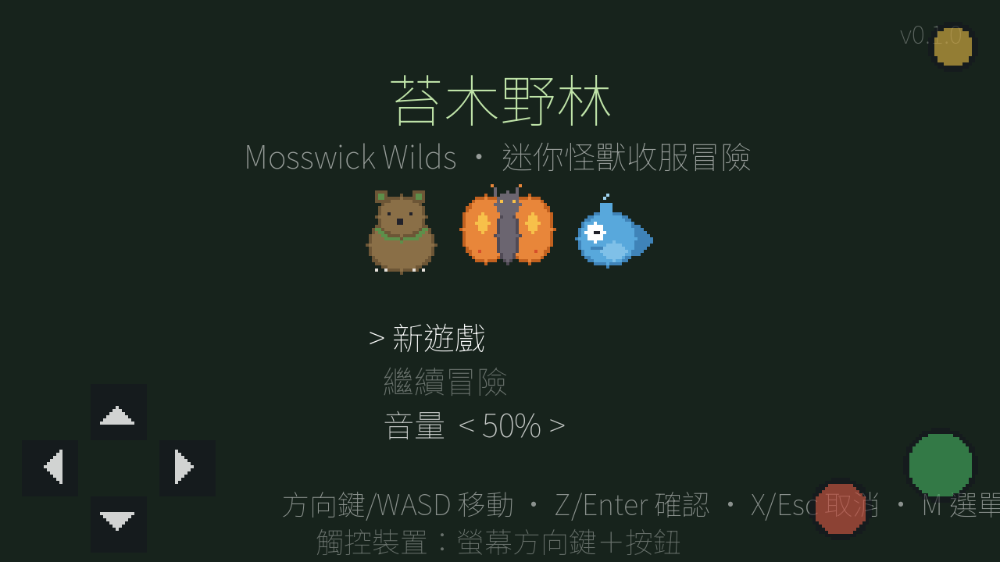
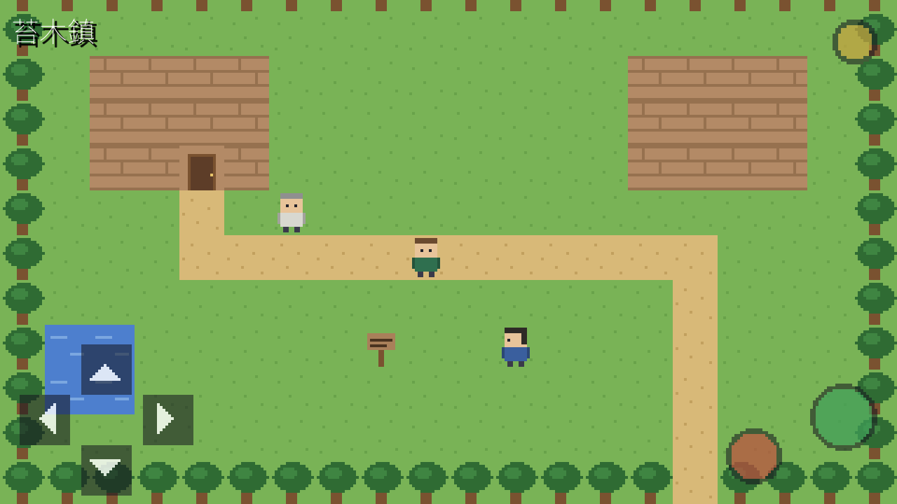
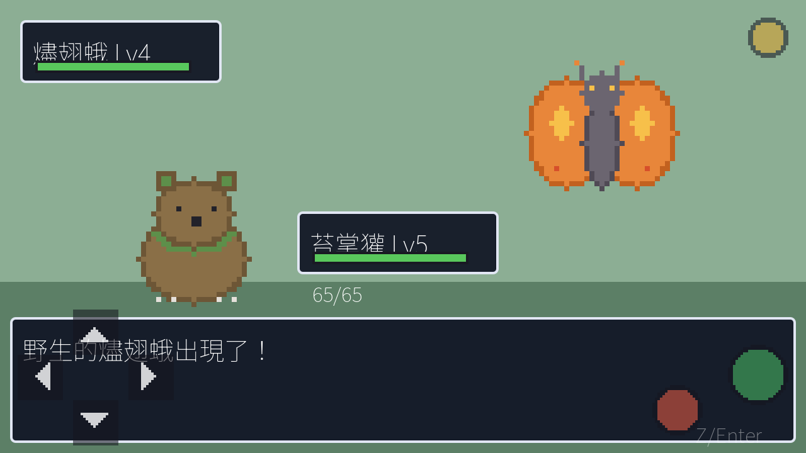

# 苔木野林 Mosswick Wilds

原創 2D 像素俯視角怪獸探索 RPG 的 **Vertical Slice（MVP）**，遊戲內文字為繁體中文。
玩法借鑑 1990 年代掌機怪獸收集 RPG 的抽象機制（格狀移動、草叢遭遇、回合制戰鬥、
捕捉、隊伍與道具、存檔），但世界觀、怪獸、地圖、對話、素材全部原創，
不含任何受著作權保護的第三方內容。



| 小鎮探索 | 回合制戰鬥 |
|---|---|
|  |  |

## 使用技術

| 項目 | 值 |
|---|---|
| Engine | Godot **4.7.2 Stable**（CI 釘死此版；本機以 4.7.1 Stable 驗證過） |
| 語言 | typed GDScript（開啟 untyped_declaration warning） |
| Renderer | Compatibility（GL） |
| 內部解析度 | 320 × 180，integer scaling，Nearest filtering |
| Tile | 16 × 16 |
| 主要平台 | Web（次要：Windows） |
| 版控 | Git（不提交 `.godot/`、`build/`） |

## 本機啟動

```powershell
# 以你的 Godot 4.7.x 路徑為例
$godot = 'D:\Tools\Godot\4.7.1-stable-standard\Godot_v4.7.1-stable_win64_console.exe'

# 開編輯器
& $godot --editor --path .

# 直接跑遊戲
& $godot --path .

# 第一次 clone 後先 import（建立 class cache 與素材匯入）
& $godot --headless --path . --import
```

## 操作方法

**桌面鍵盤**

```text
Arrow Keys / WASD : 移動（格狀、四方向，輕點轉向、長按行走）
Z / Enter         : 確認、對話、互動
X / Escape        : 取消、返回
M                 : 開啟選單（隊伍／背包／存檔）
```

**手機瀏覽器**：自動偵測觸控裝置後顯示左下虛擬十字鍵、右下確認（綠）／取消（紅）、
右上選單（黃）。非觸控裝置不顯示。

## 測試指令

```powershell
# Headless 驗證（import + class cache）
& $godot --headless --path . --import

# 自動化測試（失敗回傳非零 exit code；目前 499 asserts）
& $godot --headless --path . --script res://tests/run_tests.gd

# Web Export Smoke Test
& $godot --headless --path . --export-release "Web" build/web/index.html
```

測試涵蓋：格狀移動／穿牆／斜向禁止、傷害公式（固定 seed 重放）、速度決定行動順序、
道具扣除、捕捉成功與失敗、隊伍上限、存檔往返一致、損壞存檔容錯、`.tmp` 復原、
Schema 版本閘門、全場景載入、全腳本編譯、資料完整性（無懸空 id／warp／sprite）。

## Web Export 與 GitHub Pages 部署

- Export Preset：`Web`（`export_presets.cfg`），輸出 `build/web/`
  （index.html / index.wasm / index.pck / index.js / 圖示與啟動畫面）。
- `thread_support=false`：不需要 COOP/COEP header，可部署於任何靜態網站
  （含 GitHub Pages 子路徑）。
- CI：`.github/workflows/deploy-web.yml` — push 到 `main` 即
  Checkout → 安裝 Godot 4.7.2 + Export Templates → Headless 驗證 → 測試 →
  Web Export → 部署 GitHub Pages。
- 第一次部署前，repo Settings → Pages → Source 選 **GitHub Actions**
  （workflow 已帶 `enablement: true`，通常會自動啟用）。

## 專案架構

```text
res://
├─ assets/            產生的 placeholder 像素素材（tilesets/characters/creatures/ui/audio）
├─ data/              全部遊戲資料（JSON、資料驅動）
│  ├─ creatures/  3 隻原創怪獸（id/stats/skills/capture_rate/sprite_path...）
│  ├─ skills/  ├─ items/  ├─ encounters/  ├─ maps/  └─ dialogue/
├─ scenes/            薄場景（root+script；UI 由程式建構）
│  ├─ main/ battle/ world/ characters/ ui/
├─ scripts/
│  ├─ domain/         純規則層（RefCounted、不碰 scene tree、RNG 可注入）
│  │   BattleService / DamageCalculator / EncounterSystem / GridMovement / MapData ...
│  ├─ core/           Autoload 服務：GameState / SceneRouter / InputRouter /
│  │                  DialogueManager / EventFlagStore / Party / Inventory / Audio / DataRegistry
│  ├─ persistence/    SaveService（user://、原子寫入、schema migration）
│  ├─ world/ ui/ battle/  各場景的呈現層
├─ tests/             headless 測試（run_tests.gd 為進入點）
├─ tools/             generate_placeholders.gd（產素材）
└─ docs/screenshots/  QA 截圖（由 DebugTour 產生）
```

視覺 QA：`& $godot --path . --resolution 1280x720 -- --tour`
會自動走過標題→小鎮→選單→戰鬥→野路→室內並輸出截圖到 `build/qa/`。

## Placeholder 素材替換方式

所有素材由 `tools/generate_placeholders.gd` 程序化產生，路徑寫在資料層：

1. 直接用同名同尺寸 PNG 覆蓋 `assets/` 下的檔案即可（角色 32×64 的 2×4 幀、
   怪獸 32×32、tile 16×16 橫排 atlas，順序 `GTPWRBFIDSM`）。
2. 怪獸圖路徑在 `data/creatures/creatures.json` 的 `sprite_path`，NPC 圖在
   `data/maps/*.json` 的 `npcs[].sprite`，可自由指到新檔。
3. 所有像素素材保持 Nearest（專案預設），不要開 filtering。

## 已知限制（本次 Vertical Slice 範圍外）

- 無經驗值／升級／進化，無屬性相剋（僅同屬性技能加成）。
- 無戰鬥動畫、無背景音樂（SFX 為程序化 beep）。
- 中文字型內嵌 Noto Sans TC（SIL OFL 授權，`assets/fonts/`，約 12MB，Web 包體因此變大）；
  像素風中文字型可後續替換。
- 敵方 AI 為隨機選招；只有單一存檔欄位。
- Windows Export Preset 已建立但未實測（本機僅安裝 Web export templates）。

## Roadmap（建議下一階段）

1. 經驗值／升級與技能成長；戰鬥切換上場怪獸。
2. 屬性相剋表（資料驅動）＋戰鬥動畫與音樂。
3. 第四張地圖＋首領戰，串起最小劇情線。
4. i18n（Godot translation csv）與英文語系；像素風 CJK 字型。
5. 存檔多欄位＋雲端（localStorage 之外的）備援。
