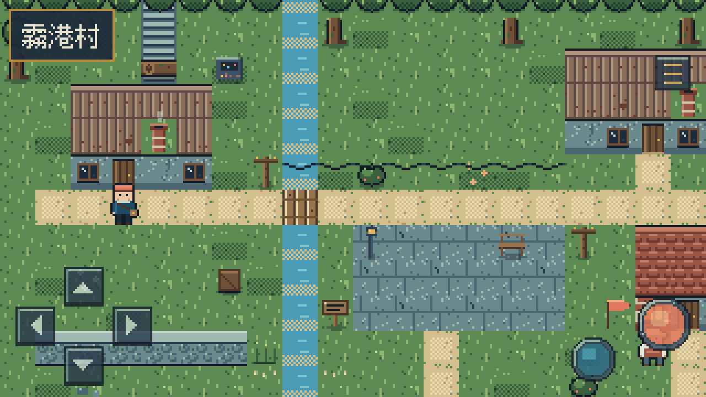
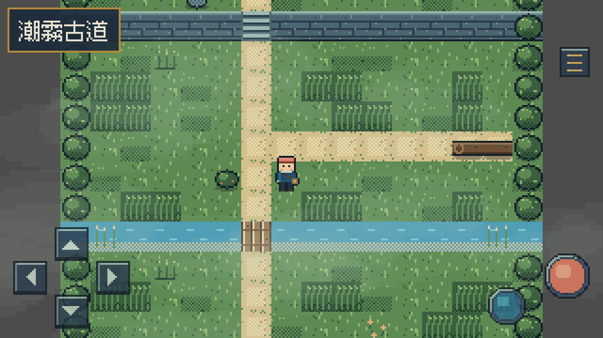
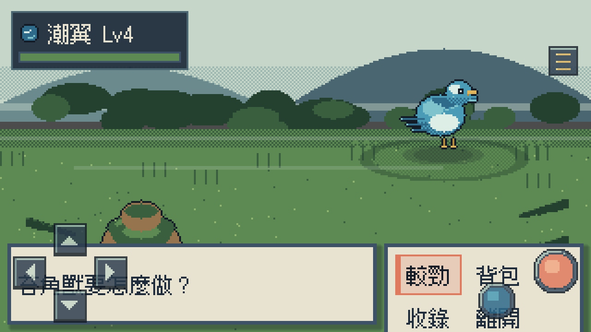
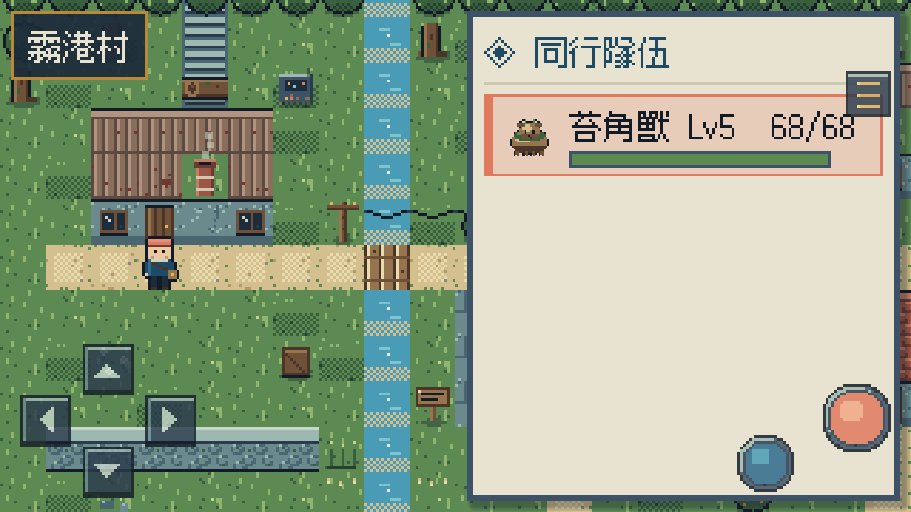

# 潮霧群島 Tidemist Isles

原創 2D 像素俯視角 RPG 的 **Vertical Slice**。你是霧港村新上任的**回聲觀測員**：
這座亞熱帶群島的環境會把聲音留在物質裡，吸附了回聲的生物成為「**迴靈**」。
古道的回聲三週來持續變薄、封存三十年的觀測塔半夜自己開始廣播——
你的工作不是變強，是**弄清楚牠們在聽什麼**。

世界觀：`docs/world-bible.md`｜美術：`docs/art-bible.md`＋`docs/palette.md`｜
UI：`docs/ui-system.md`｜稽核：`docs/visual-audit.md`（Before/After 截圖）


| 霧港村 | 潮霧古道 |
|---|---|
|  |  |

| 較勁（戰鬥） | 觀測手冊 |
|---|---|
|  |  |

## 使用技術

| 項目 | 值 |
|---|---|
| Engine | Godot **4.7.2 Stable**（CI 釘此版；本機以 4.7.1 Stable 驗證） |
| 語言 | typed GDScript（untyped_declaration warning 開啟） |
| Renderer | Compatibility（GL） |
| 解析度 | 320×180、integer scaling、Nearest、無 mipmaps |
| Tile | 16×16；角色 16×24；迴靈戰鬥畫布 64×64 |
| 色盤 | 全域 40 色（`docs/palette.md`） |
| 字型 | Fusion Pixel 12px 繁中（OFL，關閉 AA/subpixel） |
| 主要平台 | Web（次要：Windows） |

## 本機啟動

```powershell
$godot = 'D:\Tools\Godot\4.7.1-stable-standard\Godot_v4.7.1-stable_win64_console.exe'
& $godot --editor --path .   # 開編輯器
& $godot --path .            # 直接跑遊戲
& $godot --headless --path . --import   # 第一次 clone 後先 import
```

## 操作方法

```text
方向鍵 / WASD : 移動（格狀四方向；輕點轉向、長按行走）
Z / Enter     : 確認、對話、調查
X / Escape    : 取消、返回
M             : 觀測手冊（隊伍／工具包／記錄）
```

觸控裝置自動顯示儀器風按鍵：左下十字鍵、右下確認（珊瑚）／取消（海藍）、右上選單。

## 測試與驗證

```powershell
& $godot --headless --path . --import                              # Headless 驗證
& $godot --headless --path . --script res://tests/run_tests.gd     # 自動化測試（880 asserts）
& $godot --headless --path . --export-release "Web" build/web/index.html   # Web Export
& $godot --path . --resolution 1280x720 -- --tour                  # 視覺 QA：自動截圖到 build/qa/
```

測試涵蓋：穿牆／斜向禁止／物件層碰撞／warp 格規則、傷害公式 seed 重放、
速度順序、道具扣除、收錄成敗（clone-RNG）、隊伍上限、存檔往返、損壞容錯、
`.tmp` 復原、**Schema v1→v2 遷移**、全場景載入、全腳本編譯、
資料完整性（legend 覆蓋／圖塊存在／warp 落點可走／素材檔存在，452 項）。

## Web Export 與 GitHub Pages

- Preset `Web` → `build/web/`；`thread_support=false`，免 COOP/COEP，任何靜態站可放。
- CI（`.github/workflows/deploy-web.yml`）：push `main` → 裝 Godot 4.7.2 →
  驗證 → 測試 → Export → 部署 Pages。
- 線上版：https://jia-hong-peng.github.io/mosswick-wilds/

## 專案架構

```text
res://
├─ assets/           程式生成的像素素材（tilesets/characters/creatures/battle/ui/fonts）
├─ data/             全資料驅動（JSON）
│  ├─ creatures/ skills/ items/ encounters/ dialogue/
│  └─ maps/          三層網格（ground/deco/overhead）＋per-map legend＋warp/互動點/NPC/炊煙/霧
├─ scenes/           薄場景（root＋script）
├─ scripts/
│  ├─ domain/        純規則（RefCounted、RNG 注入）：BattleService/DamageCalculator/
│  │                 EncounterSystem/GridMovement/MapData…
│  ├─ core/          Autoload：GameState/SceneRouter/InputRouter/DialogueManager/
│  │                 EventFlagStore/Party/Inventory/Audio/DataRegistry/DebugTour
│  ├─ persistence/   SaveService（原子寫入、v1→v2 migration、位置安全網）
│  ├─ world/         三層 TileMap 渲染（動畫 tile）、玩家（4 幀步行＋腳步聲）、NPC（微動作）
│  ├─ ui/            UiTheme 設計系統＋各畫面
│  └─ battle/        戰鬥演出（進場/前搖/受擊/震動/粒子/收錄動畫/結算）
├─ tools/pixgen/     素材產生器（Pal 色盤／Pix 繪圖庫／tiles/characters/creatures/ui/backgrounds）
├─ tests/            headless 測試（run_tests.gd）
└─ docs/             world-bible / art-bible / palette / ui-system /
                     visual-audit / asset-manifest / asset-licenses / screenshots(before,after)
```

## 素材替換方式

全部素材為程式生成的「設計稿」，狀態與替換規則見 **`docs/asset-manifest.md`**：
同路徑、同尺寸、同表格佈局覆蓋即生效，不需改程式；色盤限 40 色、Nearest、
角色腳底貼齊畫布底、圖集佈局以 `tile_catalog.gd` 為準。

## 已知限制

- 無經驗值／升級／進化；無屬性相剋（僅同屬性技能加成）。
- 無背景音樂（14 類 SFX 為程序化合成）；素材屬設計稿等級（見 asset-manifest 🟨 項）。
- 敵方 AI 隨機選招；單一存檔欄位；Windows preset 未實測（本機僅裝 Web templates）。

## Roadmap

1. 舊觀測塔章節：磁帶播放解謎＋首領級異常迴靈。
2. 經驗值／成長與換角上場；狀態效果。
3. 專業美術重繪 manifest 🟨 項；BGM（海霧環境音）。
4. i18n 框架（translation csv）＋英文版。
