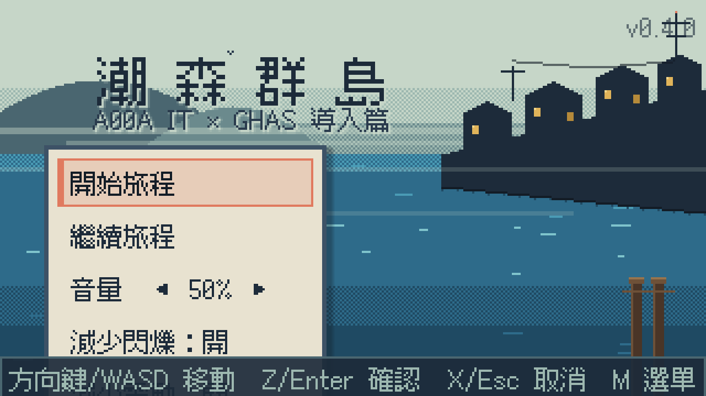
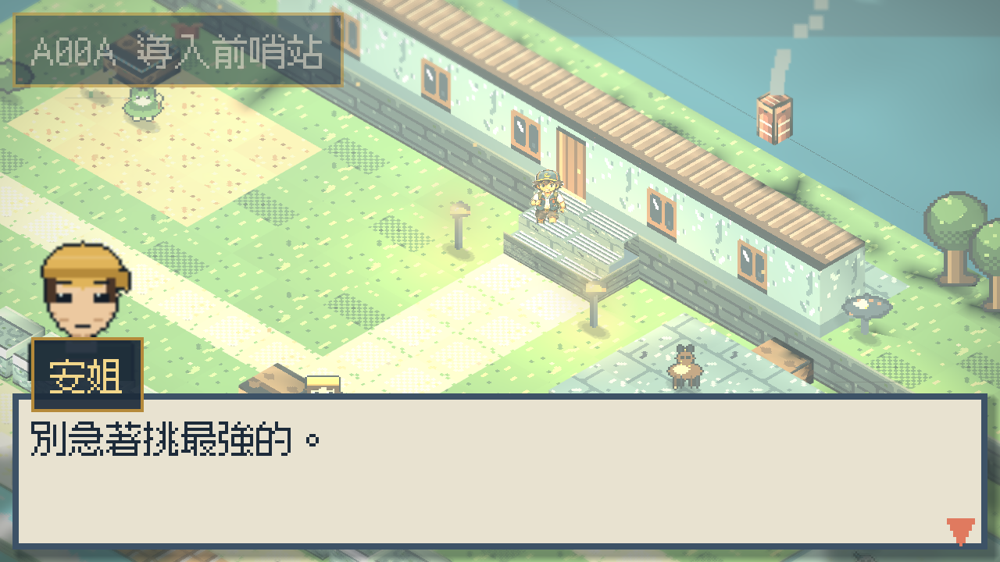
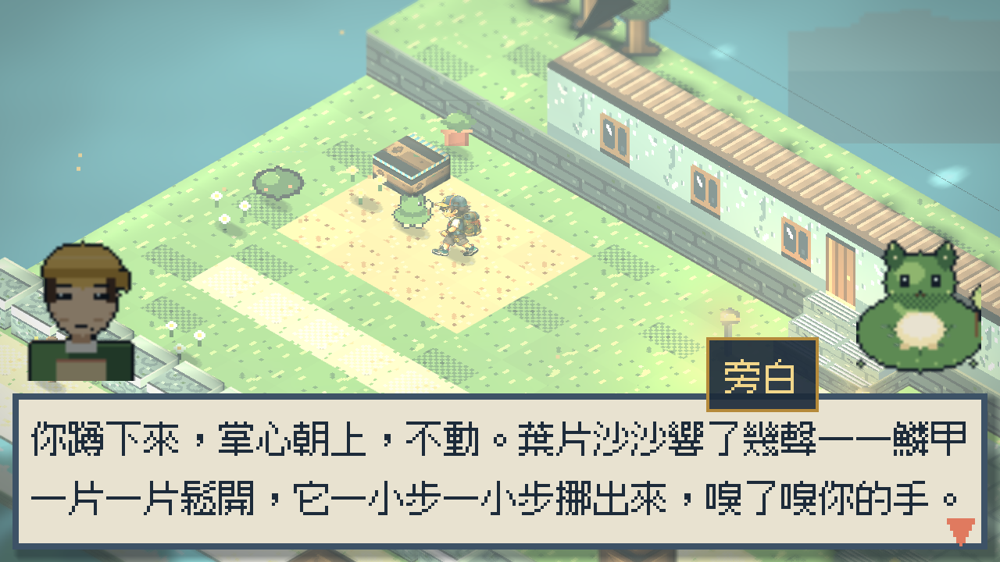
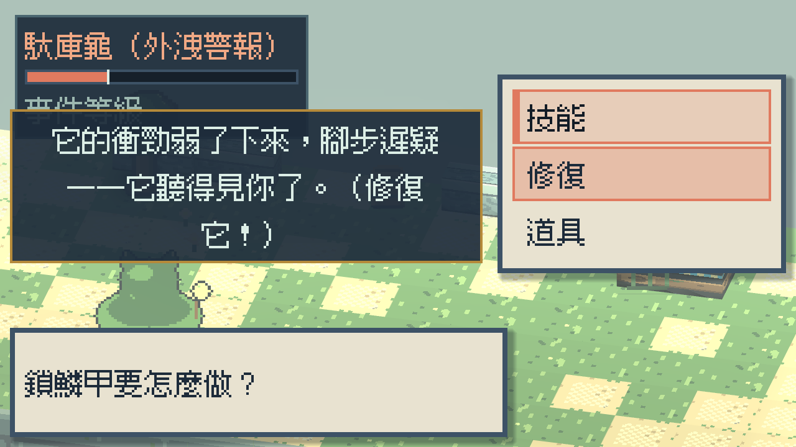
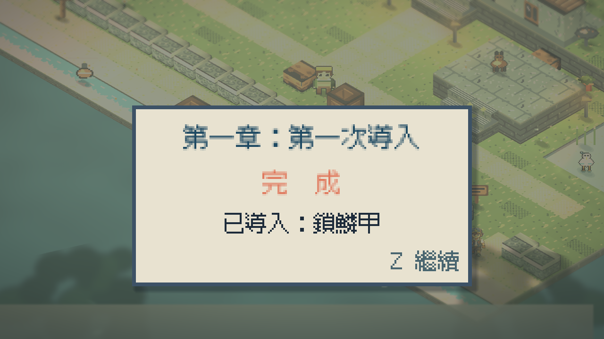

# 潮森群島 Tidegrove Isles — A00A IT × GHAS 導入篇

**A00A 部門的 GitHub Advanced Security（GHAS）導入宣導遊戲**：
GitHub 平台＝群島世界、三個安全功能＝御三家、導入流程＝遊戲流程。
表層是原創 **2.5D 像素立體劇場**怪獸養成 RPG，裡層每個機制對應一條宣導訊息。
用語一律 IT 用語，不造原創詞。

背景：**Checkmarx／SonarQube／Mend 分階段退役**，防線交接給 GHAS——
三套工具功成身退，交接不留空窗。

你是 A00A IT 的一般開發者。今天輪到你的團隊試點 GHAS——
到導入前哨站與三個功能的代表角色互動——設定直接長在功能上：
把秘密鎖進鱗甲的穿山甲**鎖鱗甲**（Secret Protection）、
專啄深處之蟲的啄木鳥**啄錯鳥**（Code Security／CodeQL）、
把亂枝理成水壩的河狸**理木狸**（Code Quality）。
**三隻都能導入**——一隻一隻來，三道防線都帶上才完整。
然後處理你的第一起事件：金鑰外洩、警報大作，老服務**馱庫龜**驚慌暴走。
你不能打倒它——降級事件、不咎責，最後**修復**它。

| 遊戲機制 | 宣導訊息 |
|---|---|
| 三選三御三家 | 先試點、再擴大，三個功能都導入 |
| 推送攔阻減傷 | Push Protection 在事前擋下外洩 |
| 戰鬥前兆判讀 | Alert 依嚴重度分級處理 |
| 修復機制（打不死） | 事件應變：不咎責、輪替金鑰、修復 |
| 登記收服（空白啟用標籤） | 在一個 repo 上啟用功能；席次有成本 |
| 公告板退役公告 | 舊工具功成身退、防線交接不留空窗 |
| 對手老桑 | 「SonarQube 用十年好好的幹嘛換」——正面回應真實抗拒 |

**線上遊玩：https://jia-hong-peng.github.io/mosswick-wilds/**



| 試點日開場（安姐） | 導入互動（鎖鱗甲） |
|---|---|
|  |  |

| 事件應變戰（前兆判讀＋修復窗口） | 章節完成 |
|---|---|
|  |  |

## DEMO 流程（首玩約 3.5–5 分鐘）

```text
0:00 開場運鏡：前哨站晨光 → 三個活動區 → 章節卡「第一章：第一次導入」（可跳過）
0:20 試點日：與三個功能的代表角色各自互動（掌心等它開鱗／手臂接住三啄／亂枝引它整理）→ 導入確認
     → 試點申請 → 啟用標籤 → 暱稱（可保留原名）→ 專屬演出 → 自動存檔
     ※ 三隻都能導入——回頭把另外兩道防線也帶上
1:30 第一次同行：夥伴實際跟隨（三隻個性不同）→ 與夥伴互動 → 安姐交付導入工具包
2:00 事件：金鑰外洩警報大作——老服務馱庫龜驚慌暴走，撞破圍欄衝進院子
2:30 事件應變戰（60–90 秒、3–8 有效回合）：判讀前兆＝alert 分級（噴氣／縮甲／衝撞）
     → 三道防線各有解法（藤蔓鎖拖慢＋推送攔阻硬吃／深度掃描破防速攻／潛游閃避連擊）
     → 事件等級壓到底線後「修復」收尾——純攻擊不可能獲勝，blameless
4:00 撤銷輪替外洩 token → 服務恢復 → 安姐發三張啟用名額 → 走向舊程式碼海岸
     → 章節完成＋已導入清單 → 公告板伏筆：影子系統（一雙不同顏色的眼睛）
```

## 操作

```text
方向鍵 / WASD : 移動　　Z / Enter : 確認・互動（面向夥伴＝呼喚它）
X / Escape    : 取消・跳過演出　　M : 旅行手冊
```

觸控裝置自動顯示螢幕按鍵（十字鍵／確認／取消／選單）。
標題選單含音量、「減少閃爍／減少震動」輔助選項與「畫質：高／低」。

## 視覺：原創 2.5D 像素立體劇場

2D 像素角色 × 3D 立體場景。Compatibility Renderer／WebGL 2.0 限定實作：
固定 ¾ 斜角正交攝影機（水平 45°、俯角 35°，遊玩不旋轉）、
斜屋頂（山形雙坡＋屋簷懸挑＋山牆）、階梯與高台實體幾何、
地形＋建築＋道具合併單一 ArrayMesh（頂點色烘焙面向明暗＋逐格色差）、
Sprite3D 立牌角色（Nearest／Alpha Scissor／Y 軸 Billboard／腳底 blob 陰影）、
冷色環境光 × 暖色晨光（含即時建築投影，High）＋≤3 局部暖燈、
分層霧面片＋金色光塵＋前景柔焦框景、捲動噪聲水面（無 SSR）、
輕量單通道帶狀柔焦（假移軸）＋暗角。詳見
`docs/hd2d-reference-analysis.md`／`docs/web-shader-inventory.md`／`docs/web-hd2d-performance.md`。

## 技術

| 項目 | 值 |
|---|---|
| Engine | Godot **4.7.2 Stable**（CI 釘死；本機 4.7.1 驗證） |
| 規格 | typed GDScript・Compatibility・1280×720（canvas_items stretch）・MSAA 4x・32px texel |
| 御三家 | 資料驅動（`data/starters/starters.json`）：互動、跟隨個性、戰鬥定位、結尾動畫 |
| 字型 | Fusion Pixel 12px 繁中（OFL） |
| 音訊 | 全程序化合成：環境音狀態機＋危機戰雙層音樂＋SFX（含三隻叫聲、導入樂句） |
| 存檔 | user:// JSON・原子寫入・Schema **v4**（舊版回聲存檔安全重置，不崩潰）・導入／通關自動存檔 |

## 驗證指令

```powershell
$godot = 'D:\Tools\Godot\4.7.1-stable-standard\Godot_v4.7.1-stable_win64_console.exe'
& $godot --headless --path . --import                              # Headless 驗證
& $godot --headless --path . --script res://tests/run_tests.gd     # 2831 asserts
& $godot --headless --path . --export-release "Web" build/web/index.html
& $godot --path . --resolution 1280x720 -- --tour                  # 導入鎖鱗甲完整通關（草系解法）
& $godot --path . --resolution 1280x720 -- --tour-fire             # 導入啄錯鳥（爆發解法）
& $godot --path . --resolution 1280x720 -- --tour-water            # 導入理木狸（速度解法）
& $godot --path . --resolution 1280x720 -- --tour-continue         # Continue 恢復驗證
```

測試涵蓋：危機戰規則（前兆序列一致／恐慌 30% 下限／修復時機閘門／
三系策略路線 3–10 回合必勝／破防・閃避・減速機制／敗北）、
導入流程（互動旗標／確認二擇／世界動作訊號／旅行包發放／夥伴互動變體／伏筆變體）、
存檔 v1→v4 遷移鏈（回聲版存檔安全返回新遊戲開場、無殭屍旗標）、
資料引用完整性（1372 項：立繪／FX／動作白名單／地圖圖例／素材檔案存在）等。

## 專案架構重點

```text
scripts/domain/crisis_battle_service.gd  危機戰規則（純邏輯、前兆制、恐慌下限、修復收尾）
scripts/world/world_scene.gd             開場運鏡／導入演出導演／結局三變化／伏筆
scripts/world3d/{stage_builder,follower_3d,camera_rig,screen_grade}.gd
scripts/battle/{crisis_battle_scene,battle_stage_3d}.gd
data/starters/starters.json              御三家資料驅動定義
data/maps/haven.json                     A00A 導入前哨站（三層網格＋elevation）
tools/pixgen/*                           全素材產生器（含御三家六表情立繪與世界行走圖）
```

## 已知限制（誠實清單）

- 全素材為**程式生成設計稿**（工藝低於手繪；剪影與性格辨識已達成，替換規則見 asset-manifest）。
- 通關時間為自動化 bot 實測（51–63 秒）換算的人類估計，未做真人試玩取樣。
- Web 版於 Chromium 驗證啟動與 Console 無錯；畫面級／FPS／Firefox／Safari／
  行動實機驗收標註於 `docs/web-hd2d-performance.md`（尚待人工裝置驗收）。
- 危機戰指令清單開啟時會暫時遮住馱庫龜本體（版面取捨；前兆／事件演出時完整可見）。

## Roadmap

1. 第二章：公告板上那雙不同顏色的眼睛（影子系統線）；往霧杉島的航線。
2. 夥伴成長與進化潛力；照護玩法（毛刷／食盆實際使用）。
3. 專業美術重繪；真人試玩取樣與節奏調校；手機實機驗證。
